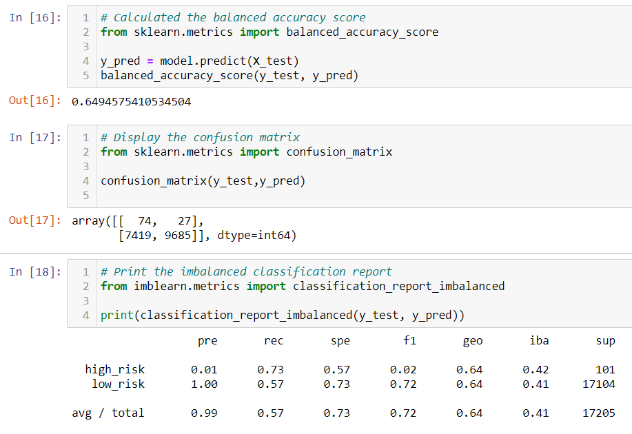
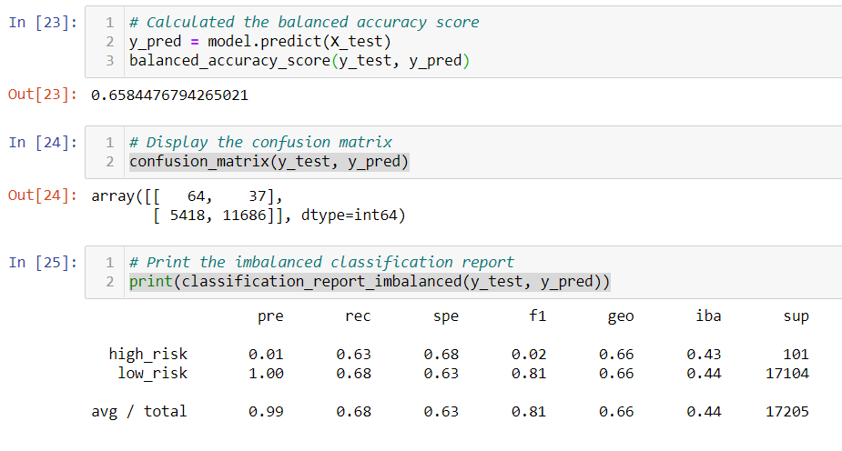
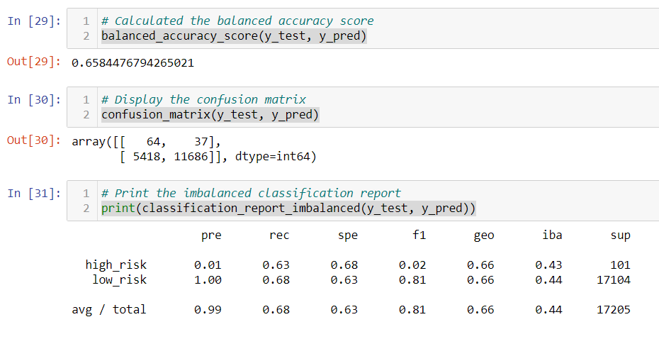
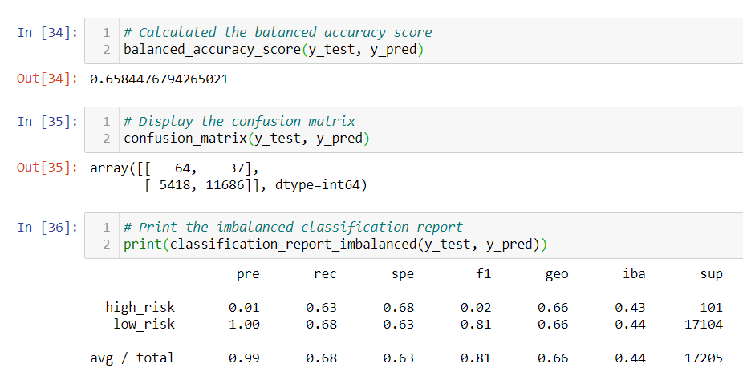
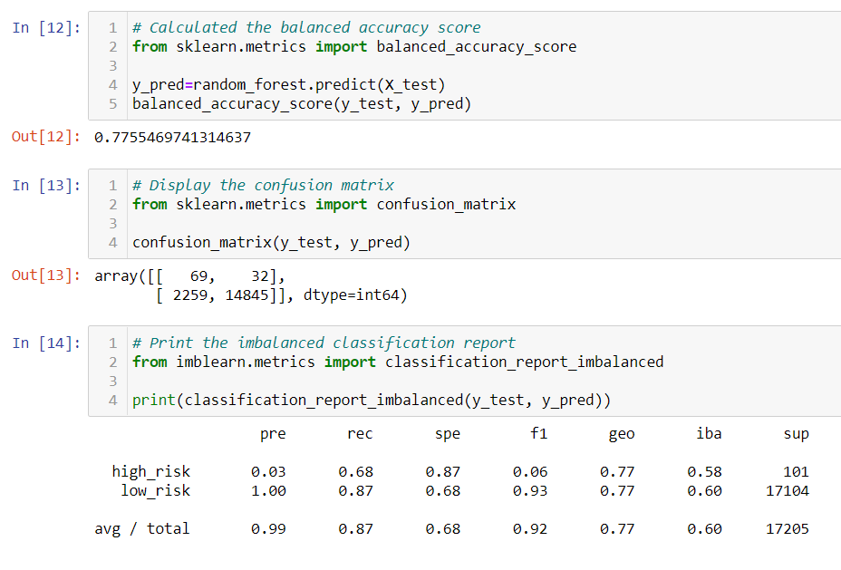
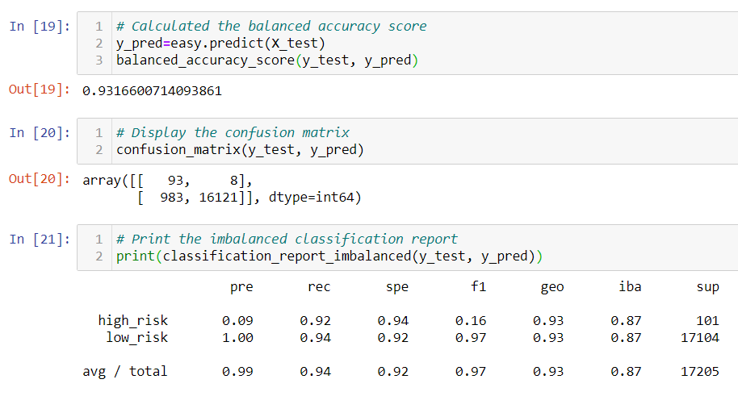

# Credit_Risk_Analysis

## Purpose of Analysis
The purpose of this analysis is to leverage relevant libraries (scikit learn and imbalanced learn) in order to develop several different models to predict credit worthiness. I built six different models that can be evaluated to determine which is most reliable; the results of each model are noted below.

## Results
* 1) Naive Random Oversampling
     * Balanced Accuracy Test: 64.9%
     * Classification Report Notes: Due to the extremely low precision for high_risk, this is not a reliable option to use.


* 2) SMOTE Oversampling
     * Balanced Accuracy Test: 65.8%
     * Classification Report Notes: Due to the extremely low preceision for high_risk, like w/ Naive Random Oversampling, this is not a reliable option to use.

 
* 3) Undersampling
     * Balanced Accuracy Test: 65.8%
     * Classification Report Notes: Due to the extremely low precision for high_risk, this is not a reliable option to use as it is nearly identical to SMOTE Oversampling


* 4) Combined Oversampling & Undersampling
     * Balanced Accuracy Test: 65.8%%
     * Classification Report Notes: Due to the extremely low precision for high_risk, this is not a reliable option to use as it once again is very similar to all others.


* 5) Balanced Random Forest
     * Balanced Accuracy Test: 77.6%
     * Classification Report Notes: Improved recall/precision totals, as well as improved high_risk value (though still low).


* 6) Easy Ensemble Adaboost 
     * Balanced Accuracy Test: 93.1%
     * Classification Report Notes: Improved recall/precision totals have us with the best option yet, along with a 9% high_risk precision which also is 3x better than the next best options.

     
## Results
Based on the analysis of the above models, the best option for use appears to clearly be Easy Ensemble Adaboost, with Random Forest being a secondary option. All four of the resampling options were significantly less reliable than the ensemble options and should not be used. It is worth noting that high_risk is a very difficult metric to determine compared to low_risk, so even with our best 2 models there's a limited level of confidence in credit worthiness decisions.


```bash
Kyle Schneider, 1/17/2020
```
